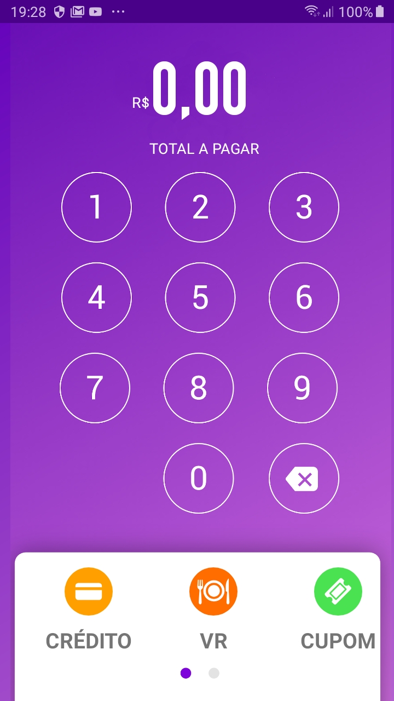

# PDVAndroid2

# Projeto Android

# O APK pode ser encontrado em: AndroidStudioProjects/PDVAndroid2/app/build/outputs/apk/debug

# Ou se prefirir executar em modo debug, o arquivo manifest contem as linha:

android:debuggable="true"  
tools:ignore="HardcodedDebugMode"

# Caso não queira, basta remove - las.

 

# Tela 1

 

# Tela 2

 

# Tela 3

